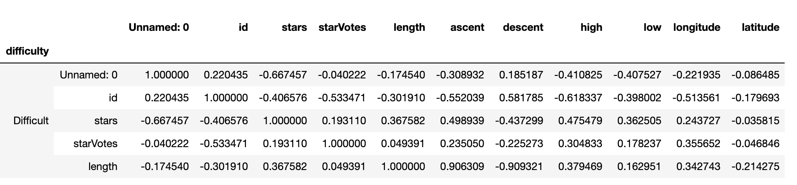
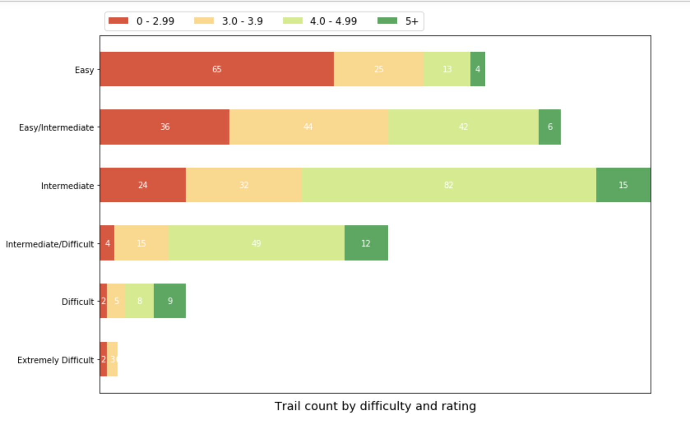
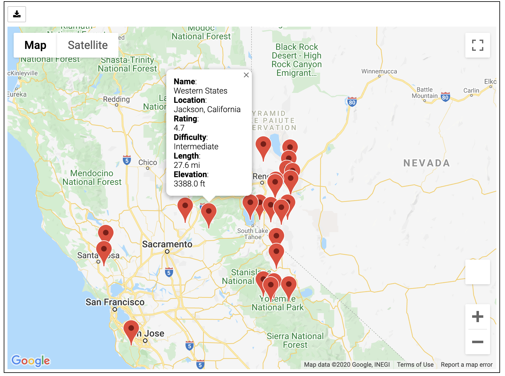

# Sacramento-Trails

## Review the project outline
Our project is to identify the factors that influence people's preference in hiking trails. We'll examine trails available within a 150 mile radius of Sacramento; find variables that affect ratings and which of these have the strongest relationship with trail ratings.
By identifying these correlations, our findings could help people identify other highly rated trails outside of the original scope.

Ratings, length, elevation, difficulty : are they related? If so, what is the relationship?
There's a strong relationship between the difficulty and the Votes that the people gives to the trail.

Along the project we're able to determinate best trails by the different variables like Elevation, Length and Difficulty, analize how many trails by Difficulty we have in a radio of 150 miles.

To finalize our project using the the Google maps we're able to locate the best trails, in this case image represent the Best trails by Elevation in a radio of 150 miles from Sacramento.

## Technology Used

